# Validation & observability research portfolio

Three synthetic research collections: a leakage-proof time-series validation study, a training-dynamics observability study, and a claims payment-integrity labelling study. Their papers and datasets differ; all three emphasize executed, inspectable evidence and explicit scope limits.

## Notebook collections

| Collection | Contents |
| --- | --- |
| [`leakage-proof-timeseries/`](leakage-proof-timeseries/) | The three notebooks inherited from the previous repository state: correlated ridge risk, post-selection Sharpe estimation, and sequential change detection. |
| [`training-dynamics-observability/notebooks/`](training-dynamics-observability/notebooks/) | Three additional executed synthetic notebooks: analytical foundations, a seeded training walkthrough, and an artifact-reusing observability audit. |
| [`claims-payment-integrity-labels/notebooks/`](claims-payment-integrity-labels/notebooks/) | Three executed notebooks on noisy reviewer labels, selective review under a finite capacity, and a joint finite-sample risk/acceptance/utility certificate. |
| [`label-free-model-monitoring/notebooks/`](label-free-model-monitoring/notebooks/) | Three executed notebooks on label-free performance-gap estimation, sequential harmful-shift detection, and a `derived here` retraining controller with a delayed-audit queue and a finite-capacity training/deployment queue. |

## Highlights

### Leakage-proof time-series validation

| Result | Number | Where |
|---|---|---|
| CorrGCV identity residual (Eq. 30, coupled duality/subordination solve) | $4.3\times10^{-16}$ | `01_research_foundations.ipynb` §1, §5 |
| Ordinary GCV relative error at strong correlation ($\xi=10^2$) | 0.98 | Fig. 1 reproduction, §5 |
| Altman GCV error factor at strong correlation | 18.5× off | Fig. 1 reproduction, §5 |
| CorrGCV relative error at strong correlation | 0.15 | Fig. 1 reproduction, §5 |
| Deterministic-equivalent theory vs. simulation, median gap | 0.026 | §5 |
| Theorem VI.1 near-horizon test-point risk ratio (vs. an independent fold) | 0.80 (≈20% optimistic) | `02_project_walkthrough_part1.ipynb` Fig E2 |
| James–Stein Kendall $\tau$ / Spearman $\rho$ at $n=1008$ | 0.677 / 0.873 (paper: $0.67\pm0.03$ / $0.87\pm0.03$) | §6 |
| Naive estimator $\tau$ at $n=1008$ | 0.510 (paper: $\approx 0.50$) | §6 |
| Repeated-FCS delay / Theorem 2.5 bound, worst case | 0.35 | §4b, §7 |
| Remark 2.3 PFA detector null false-alarm rate (Wilson upper bound, $\alpha=0.2$, 2000 runs) | 0.0019 | §7 |
| Eq. (5) e-detector inclusion, alarmed runs checked | 60 / 60 alarmed runs (120-run pool) | §7 |
| Look-ahead feature leakage, IC inflation | +0.51 | walkthrough §5 |
| Overlapping-label leakage, IC inflation | +0.11 | walkthrough §5 |
| Random-split / global-normalisation leakage, IC inflation | none measurable (honest null) | walkthrough §5 |
| Stationary-$\hat K$ CorrGCV error reduction on non-stationary data | 1.56× (85.9 → 54.9), still worse than ordinary GCV (0.32) | honest negative, walkthrough §4 |

### Training-dynamics observability

| Result | Number | Where |
|---|---|---|
| Analytic vs. computed batch Rayleigh quotient | 1.2013422819 / 1.2013422819 | `01_research_foundations.ipynb` |
| Above-threshold quadratic catapult frequency | 1.00 over 14 seeded trials | foundations, EoSS check |
| Order-level momentum transitions at the illustrated reference point | $b_1=0.40$, $b_2=0.58$, $b_3=0.67$ | foundations, Fig. R04 |
| Real NB2 learning rate / estimated deterministic boundary, arm A | 0.04 / 1.77 | `03_project_walkthrough_part2.ipynb` |
| Real NB2 learning rate / estimated deterministic boundary, arm B | 0.02 / 1.81 | walkthrough part 2 |
| Paired eight-seed loss difference, B − A | −0.0030, 95% interval [−0.0252, +0.0192] | walkthrough part 1; unresolved |

### Claims payment-integrity labels

| Result | Number | Where |
|---|---|---|
| CCEM identifiability, control vs. coverage-break stress (4 seeds × 2 regimes) | aligned error 0.020–0.027 vs. 0.156–0.186; every seed/metric effect size excludes 0 | `01_identifiability` figure; NB2 forest plot |
| Reviewer confusion-matrix recovery error, aligned | 0.082–0.086 (control) vs. 0.207–0.211 (stress) | NB1 confusion-heatmap figure |
| Naive vs. noise-aware scorer AUROC (fresh stream) | 0.46 (at/below chance) vs. 0.59 | NB2 ROC curve |
| Noise-aware precision@K lift over the 0.063 base rate | beats naive and the base rate at every K ∈ {10, 30, 60, 100} | NB2 precision@K figure |
| SCoRC certificate at the strict target alpha = 0.05 | `INFEASIBLE` at every studied capacity (first certifying target ≈ 0.11) | `02_capacity_risk` figure |
| Dollar-weighted utility, seed 11, 30/90/180 reviewer minutes | noise-aware $412 / $1,363 / $2,383 vs. naive $0 / $0 / $5 | `03_dollars_recovered` figure |
| Calibration-sampling falsifier, exceedance rate vs. alpha = 0.05 (8 seeds) | randomized audit 0.63 [0.31, 0.86] vs. selected-high-risk 1.00, selected-low-risk 0.88 | NB3 falsifier figure |

### Label-free post-deployment monitoring

| Result | Number | Where |
|---|---|---|
| Conditional retrain-count ceiling, checked settings | optimized counts 0–6 against ceilings 3.9–10.9 on 4/5 settings; the assumption-violating setting draws no ceiling | `01_research_foundations.ipynb` §6 |
| Sequential label-free alarm, no-harm false-alarm rate | 0/20 seeded no-harm streams alarm at alpha = 0.10 | NB1 §7 |
| Finite-capacity queue, budget disaggregation | completed / in-flight-at-horizon / never-requested now reported separately instead of one "stranded" number | `exec/figures/fig-a7.png` companion panel |
| Immediate vs. delayed retraining decision, `threshold` policy, 10 paired seeds | median detection delay 12 → 14 → 16 steps and miss rate 0% → 10% → 10% as label delay goes 0 → 2 → 4 | NB2 §9, Fig A9 |
| Cost priced per successfully detected seed (vs. raw mean cost) | every delayed arm costs more than immediate (13.46 → 15.56 → 14.52) even though raw mean cost is non-monotonic (13.46 → 14.01 → 13.07) | NB3 §9, reusing NB2's Fig A9 artifact |
| `no_action` vs. `threshold` separation, standardized effect size | Cohen's d ≈ 2.80, clearing the retraining-systems literature's own \|d\| > 0.5 practical-significance bar | NB3 §8 |

## Papers

### Leakage-proof time-series collection

- A. Atanasov, J. A. Zavatone-Veth, C. Pehlevan, "Risk and cross validation in ridge regression with correlated samples", ICML 2025, [arXiv:2408.04607](https://arxiv.org/abs/2408.04607).
- S. E. Pav, "Post-Selection Estimation of Sharpe Ratios", [arXiv:2606.01650](https://arxiv.org/abs/2606.01650) (2026 preprint).
- S. Shekhar, A. Ramdas, "Reducing sequential change detection to sequential estimation", ICML 2024, [arXiv:2309.09111](https://arxiv.org/abs/2309.09111).

### Training-dynamics observability collection

- S. Banerjee, T. Marrinan, R. Cannon, T. Chiang, A. D. Sarwate, "Measuring training variability from stochastic optimization using robust nonparametric testing", [arXiv:2406.08307](https://arxiv.org/abs/2406.08307).
- A. Andreyev, P. Beneventano, "Edge of Stochastic Stability: Revisiting the Edge of Stability for SGD", [arXiv:2412.20553](https://arxiv.org/abs/2412.20553).
- J.-N. Wang, Z. Huang, K. Li, L. Wu, "Momentum in large-batch training: Polyak enlarges the critical batch size, Nesterov improves data efficiency", [arXiv:2609.02728](https://arxiv.org/abs/2609.02728).

### Claims payment-integrity collection

- S. Ibrahim, T. Nguyen, X. Fu, "Deep Learning from Crowdsourced Labels: Coupled Cross-Entropy Minimization, Identifiability, and Regularization", [arXiv:2306.03288](https://arxiv.org/abs/2306.03288) (2023).
- Y. Xu, W. Guo, Z. Wei, "Selective Conformal Risk Control", [arXiv:2512.12844](https://arxiv.org/abs/2512.12844) (v2, 2026 preprint).
- X. Yu, J. Liu, "A Joint Finite-Sample Certificate for Adaptive Selective Conformal Risk Control", [arXiv:2606.08517](https://arxiv.org/abs/2606.08517) (2026 preprint).

### Label-free monitoring collection

- Q. Chen, M. Zaharia, J. Zou, "Estimating and Explaining Model Performance When Both Covariates and Labels Shift", NeurIPS 2022, [arXiv:2209.08436](https://arxiv.org/abs/2209.08436).
- S. Amoukou et al., "Sequential Harmful Shift Detection Without Labels", NeurIPS 2024, [arXiv:2412.12910](https://arxiv.org/abs/2412.12910).
- P. Nguyen et al., "Reliably Detecting Model Failures in Deployment Without Labels", NeurIPS 2025, [arXiv:2506.05047](https://arxiv.org/abs/2506.05047).
- F. Regol, L. Schwinn, K. Sprague, M. Coates, T. Markovich, "When to retrain a machine learning model", ICML 2025 / PMLR 267:51369–51404, [arXiv:2505.14903](https://arxiv.org/abs/2505.14903).
- S. Dasari, "When to Retrain: An Empirical Study of Retraining Policies for Streaming ML Under Concept Drift, Budget, and Latency Constraints", [arXiv:2608.19488](https://arxiv.org/abs/2608.19488) (2026 preprint).

## Key results

### Leakage-proof time-series validation

The core object reproduced from Atanasov, Zavatone-Veth & Pehlevan is CorrGCV (Eq. 30):

$$R_{\text{out}} = S(df_1)\,\frac{\tilde{df}_1}{\tilde{df}_1-\tilde{df}_2}\,\hat R_{\text{in}}$$

implemented by solving the coupled renormalisation jointly — duality $q\,df_1=\tilde{df}_1$ and subordination $\kappa\tilde\kappa/\lambda = 1/\tilde{df}_1$ — rather than treating either equation as given. The identity residual on this solve is $4.3\times10^{-16}$.

### Training-dynamics observability

The second collection makes batch sharpness directly inspectable through the Rayleigh quotient

$$S_b(w)=\frac{\langle\nabla L_b(w),\,H_b(w)\nabla L_b(w)\rangle}{{\lVert\nabla L_b(w)\rVert}^2}.$$

The analytic check matches to machine precision, and deliberately amplified learning rates produce catapults in every seeded quadratic trial. On the unchanged teacher–student run, however, both real optimizer arms remain far inside the estimated deterministic boundary and the one-sided sharpness condition is not crossed; that result is reported as inconclusive, not as a safety certificate. The paired eight-seed comparison also remains unresolved: four seeds favor each arm and its 95% interval includes zero.

### Claims payment-integrity labels

The third collection studies a synthetic claims-review pipeline that chains three theorem-backed pieces end to end: CCEM recovers a noisy-reviewer confusion structure only up to a label permutation (Theorem 1),

$$\min_\Pi \lVert \hat A_m - A_m^{\natural}\Pi \rVert_F^2 \le K\sigma^2(\eta + \xi_1 + \xi_2),$$

SCRC turns a fixed classifier and selection score into a selective-coverage / conditional-selected-risk guarantee under exchangeable calibration, and SCoRC certifies a finite grid of $(\lambda,\tau)$ candidates jointly on risk, acceptance and dollar-weighted utility — returning `INFEASIBLE` rather than a false certificate when no candidate clears the target. The identifiability cost of a coverage-break stress condition (specialist reviewers, a near-disconnected reviewer × class assignment) is measured directly: aligned recovery error rises from 0.02–0.03 to 0.16–0.19 across every seed and both the aligned-error and confusion-error metrics, with 95% effect-size intervals that all exclude zero.

### Label-free post-deployment monitoring

The fourth collection derives three label-free monitoring guarantees — SEES's identifiable performance gap under Sparse Joint Shift, a sequential detector's time-uniform false-alarm control, and D3M's disagreement-based deterioration test — then builds a `derived here` retraining controller on top: a lifecycle state machine, a delayed-audit label queue, a finite-capacity training/deployment queue, and an exact finite-horizon cost optimizer. The controller is connected to the delayed-audit queue directly, so an immediate-vs-delayed retraining decision is measured rather than assumed: on a ten-seed paired grid with the `threshold` policy, delaying an audited label by 2–4 steps shifts median detection delay from 12 to 14–16 steps and turns 1 of 10 "detected, later" outcomes into "never detected within the horizon." Raw mean cost under delay is non-monotonic, because a missed detection stops charging the later stages of intervention cost — priced per successfully detected seed instead, every delayed arm costs more than the immediate one.

## Figures

### Research reproductions

| | |
| --- | --- |
| 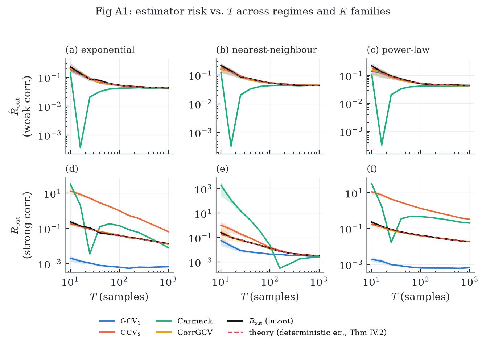<br><sub>At $N=100$ with a power-law spectrum (capacity exponent $\alpha=1.8$, source exponent $r=0.3$) and $T$ from 10 to 1000, ordinary and Altman GCV diverge from the latent risk under strong sample correlation while CorrGCV tracks it.</sub> | 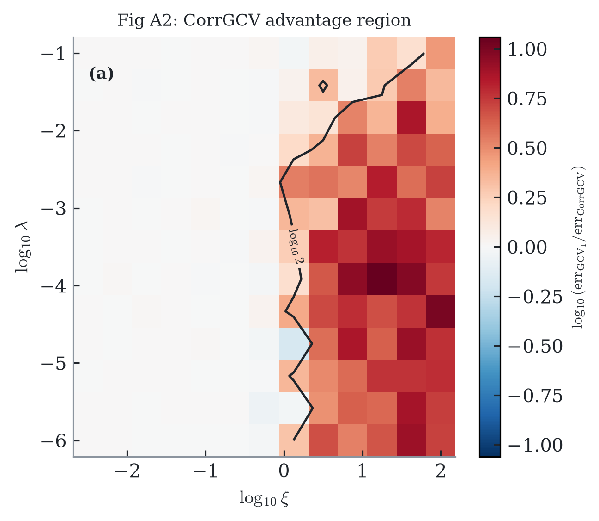<br><sub>Below $\xi\approx1$ there is no advantage; from $\xi\approx1.3$ upward CorrGCV is at least 2× more accurate than ordinary GCV, reaching about 11× near $\xi\approx16$, and the advantage is largest at small $\lambda$.</sub> |
| 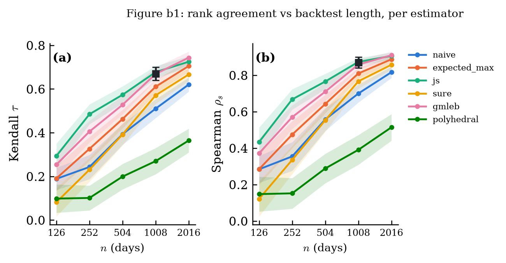<br><sub>The James–Stein estimator's rank agreement with the paper's reported $n=1008$ point ($\tau=0.677$, $\rho=0.873$ against $0.67\pm0.03$ / $0.87\pm0.03$) confirms the reproduction; the naive estimator's much lower agreement ($\tau=0.510$) shows why post-selection correction matters.</sub> | 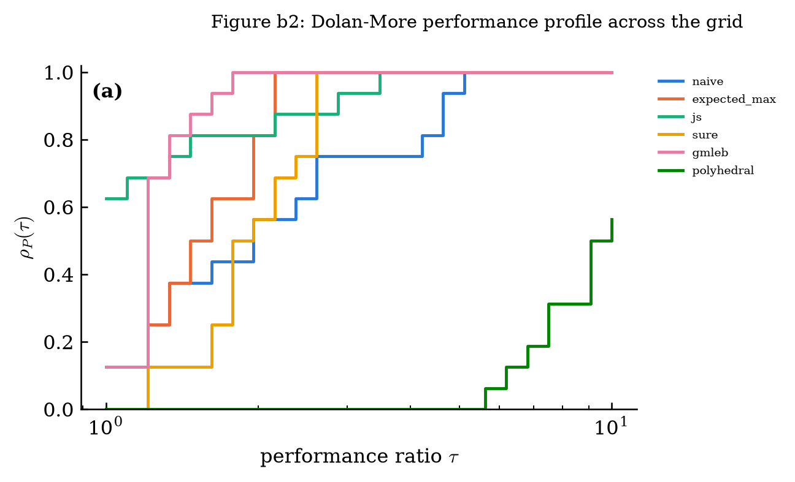<br><sub>James–Stein is the best estimator on 62.5% of grid problems (median RMSE ratio to the best = 1.00); GMLEB, expected-max, and naive are each best on 12.5%; SURE is never best (median ratio 1.78), and polyhedral is never best (median ratio 9.4).</sub> |

### Walkthrough audits

| | |
| --- | --- |
| 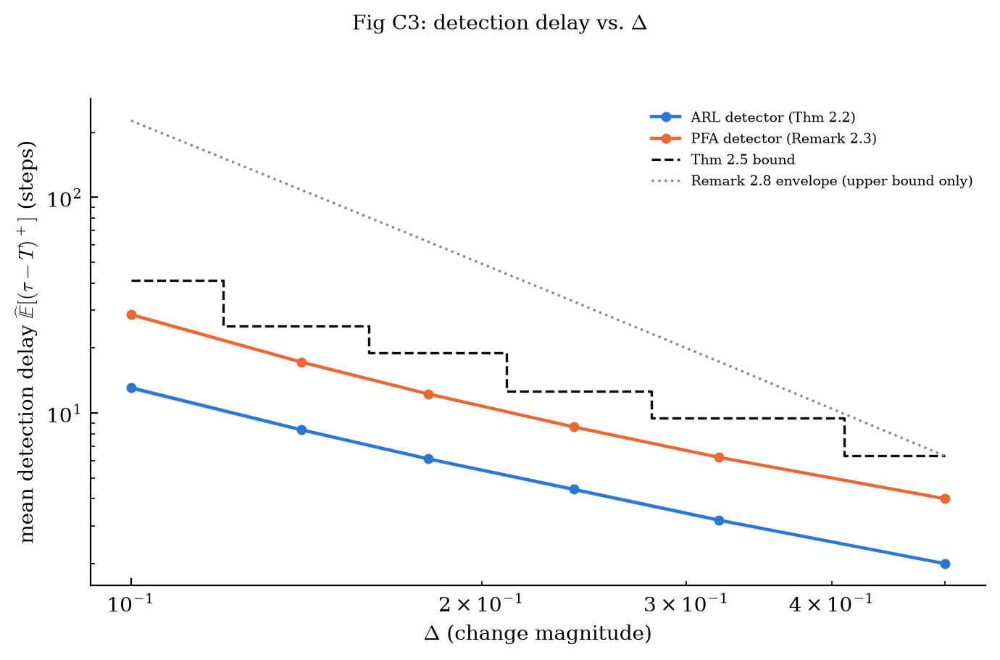<br><sub>Measured delay stays inside Theorem 2.5's bound at every tested change size, with the worst-case ratio of measured delay to bound at 0.35 — the theoretical guarantee is not just asymptotically true but numerically comfortable here.</sub> | 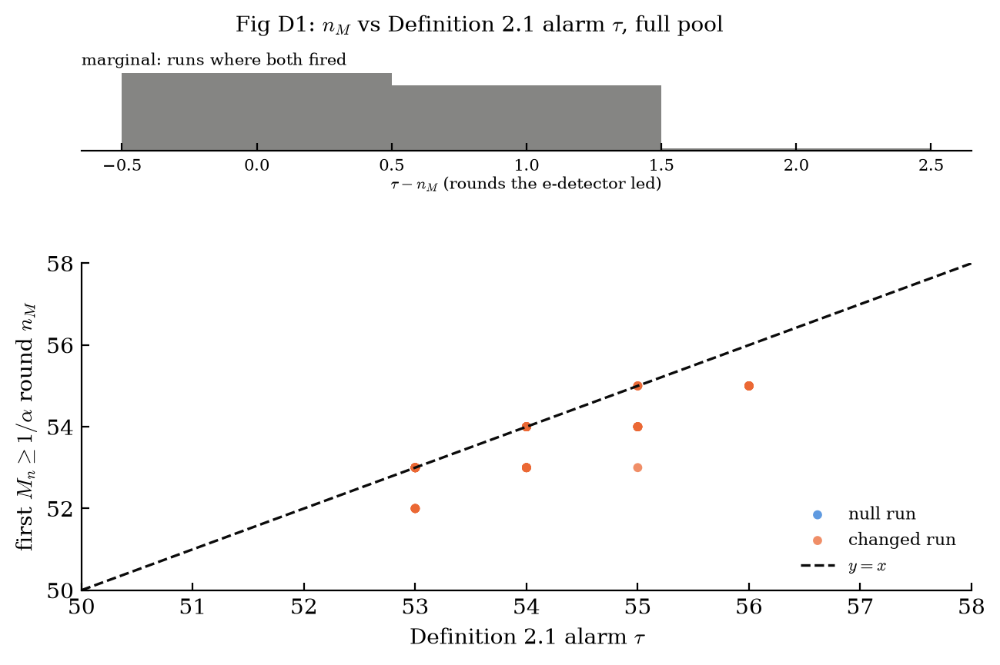<br><sub>Of the full 120-run pool (60 null, 60 changed), 60 runs alarmed; on all 60, the e-detector crossed its $1/\alpha$ threshold no later than the Definition 2.1 alarm — strictly earlier on 28 — exactly the inclusion Eq. (5) states.</sub> |
| 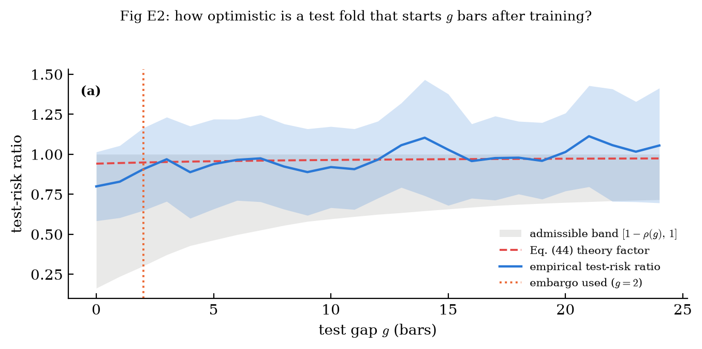<br><sub>A test fold that starts immediately after the training window — no embargo — shows a risk ratio of 0.80 against an independent fold, i.e. about 20% optimistic, and this sits inside the band Theorem VI.1 predicts for a correlated test point.</sub> | 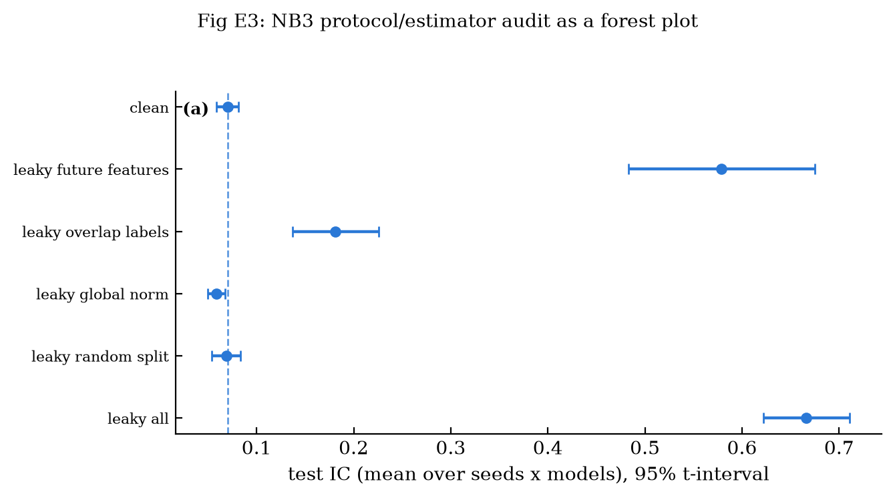<br><sub>Look-ahead features inflate IC by +0.51 and overlapping labels by +0.11; a random split and global normalisation show no measurable inflation on this generator, which is the honest null rather than a claim that those protocols are leakage-proof in general.</sub> |

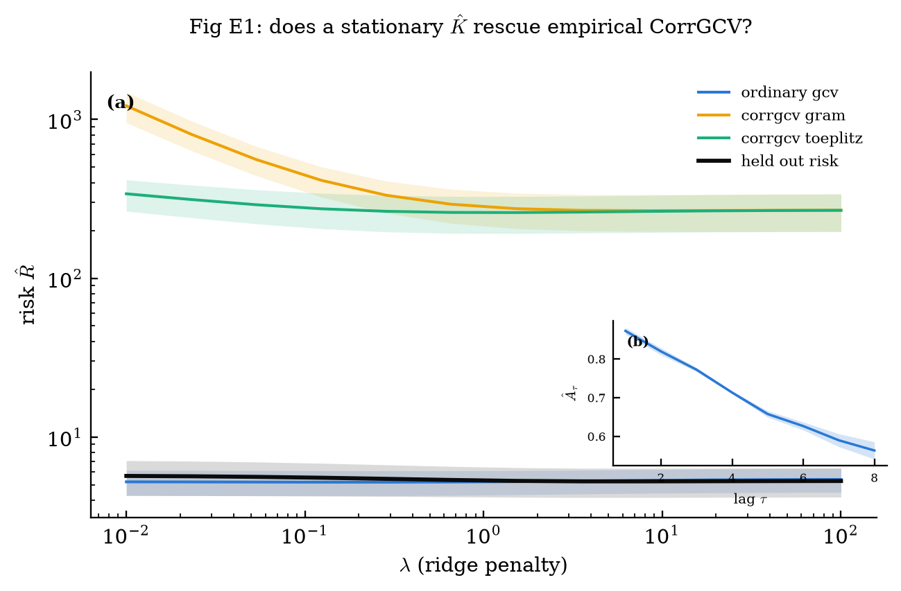

Estimating a stationary Toeplitz $\hat K$ reduces CorrGCV's mean relative error by 1.56× (85.9 → 54.9), but it remains far worse than ordinary GCV (0.32) on this non-stationary series — consistent with the source paper's own statement that CorrGCV is not established outside stationary regimes, and reported here as a limitation rather than papered over.

## Added training-dynamics evidence

The added collection uses a synthetic teacher-student task to make optimization diagnostics inspectable. Its figures show an order-level batch-scaling map, real minibatch sharpness evidence, and an honest eight-seed comparison; they are not production claims.

| | |
| --- | --- |
| 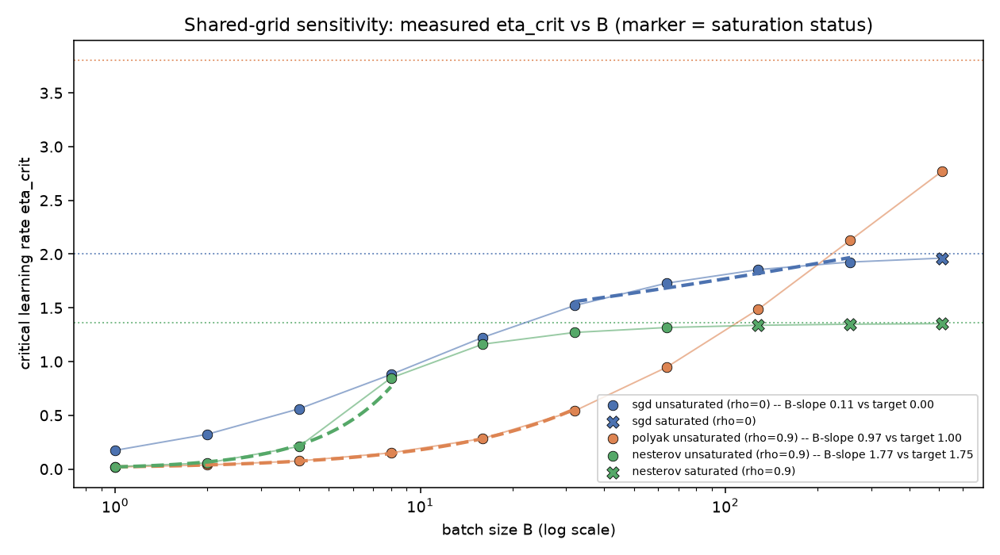<br><sub>Measured critical learning rates across batch sizes distinguish the three optimizer regimes and saturation behavior.</sub> | 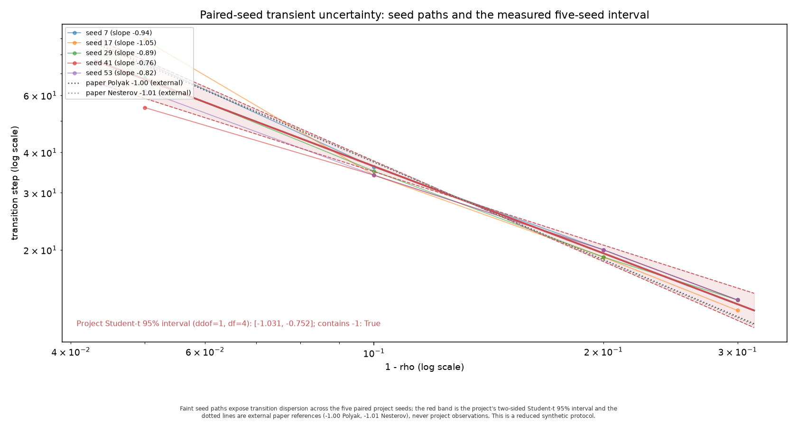<br><sub>Five paired seed paths and their Student-t interval expose transient dispersion against external order-level references.</sub> |
| 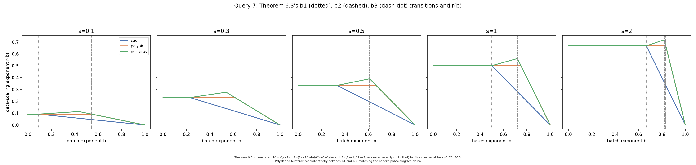<br><sub>Exact order-level `b1`/`b2`/`b3` transitions separate SGD, Polyak, and Nesterov.</sub> | 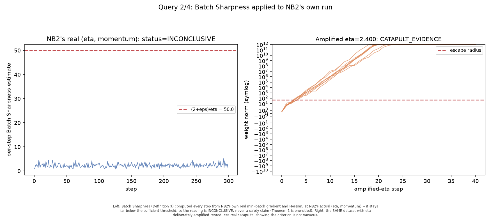<br><sub>NB2’s real trace stays below a one-sided threshold; amplified learning rates show non-vacuous catapults.</sub> |
| 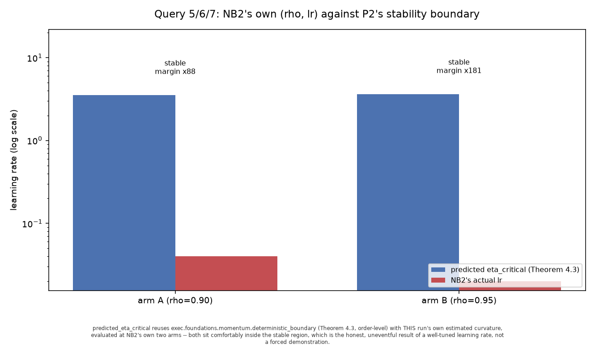<br><sub>Both real NB2 arms sit inside the estimated deterministic stable region.</sub> | 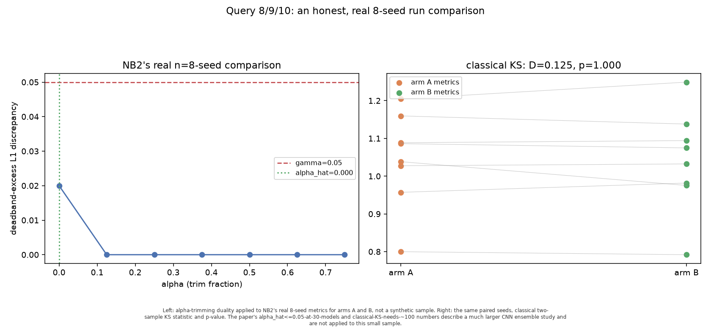<br><sub>The same eight paired seeds feed alpha trimming and classical KS; this is not paper-scale power.</sub> |

## Added claims payment-integrity evidence

The third collection's figures come from a synthetic claims-review pipeline with a known latent truth: noisy reviewer labels, a fitted CCEM scorer, a finite review capacity, and a joint risk/acceptance/utility certificate. Every number is either a paper-reported quote kept separate and labelled, or a `derived here` synthetic result.

| | |
| --- | --- |
| 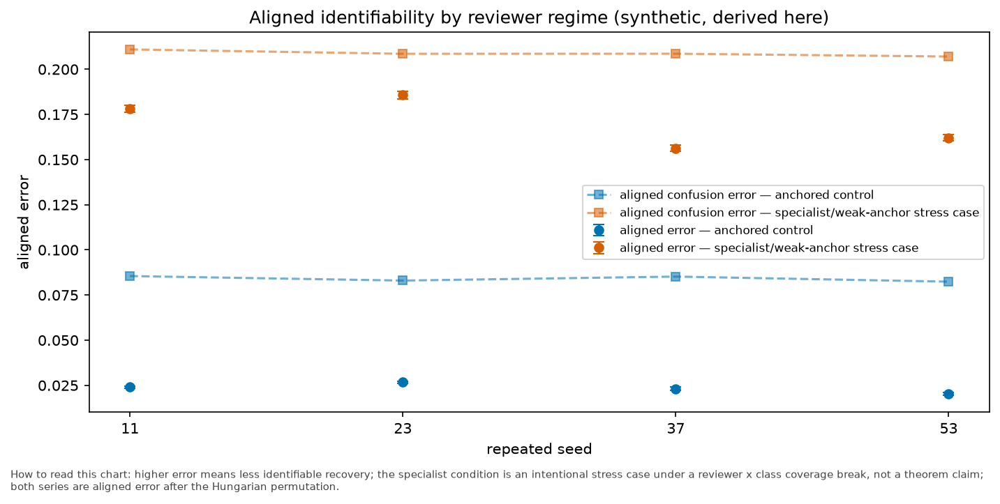<br><sub>Aligned recovery error rises from 0.02–0.03 under the anchored control to 0.16–0.19 under a coverage-break stress condition, at every seed; the confusion-matrix error shows the same pattern.</sub> | 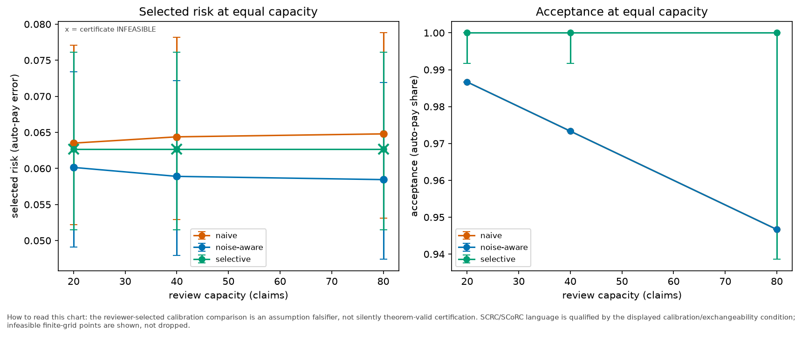<br><sub>Noise-aware accepted risk beats naive at every capacity and seed; the strict alpha = 0.05 certificate returns `INFEASIBLE` at every studied capacity, shown as a marker rather than dropped.</sub> |

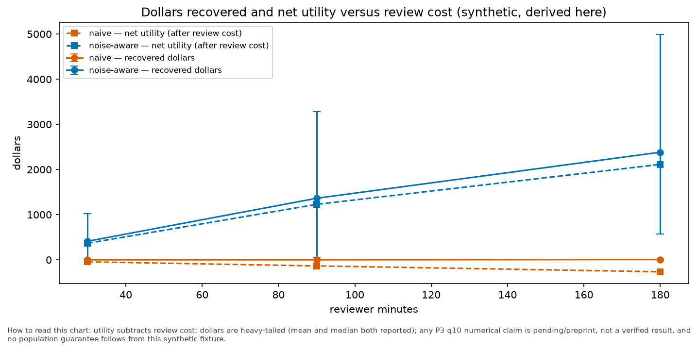

At the smallest budget (seed 11, 30 reviewer minutes) the naive top-K policy recovers essentially nothing ($0) because it misses the heavy-tailed overpaid claims that the noise-aware ranking catches; both policies eventually catch large claims as the budget grows, but the noise-aware policy's net utility (dollars recovered minus review cost) stays ahead at every budget tested.

## Added label-free monitoring evidence

The fourth collection's figures come from a synthetic deployed classifier with a known latent truth: six shift regimes, a delayed-audit label queue, a finite-capacity training/deployment queue, and a retraining controller connected to that queue so an immediate-vs-delayed decision is measured, not assumed. Every number is either a checked-assumption paper bound or a `derived here` synthetic result.

| | |
| --- | --- |
| 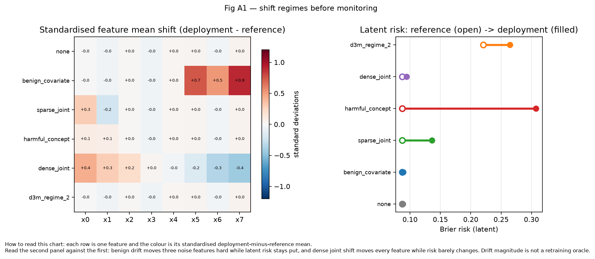<br><sub>Benign covariate drift moves three noise features hard while latent risk stays put, and dense joint shift moves every feature while risk barely changes — drift magnitude alone is not a retraining oracle.</sub> | 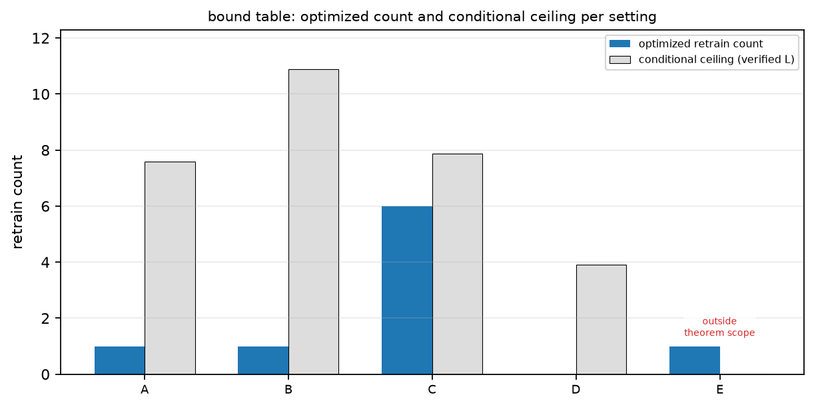<br><sub>The ceiling is drawn only where the uniform adjacent-model-gap assumption is checked; the one setting that violates it (E) is shown with no ceiling rather than a false one.</sub> |
| 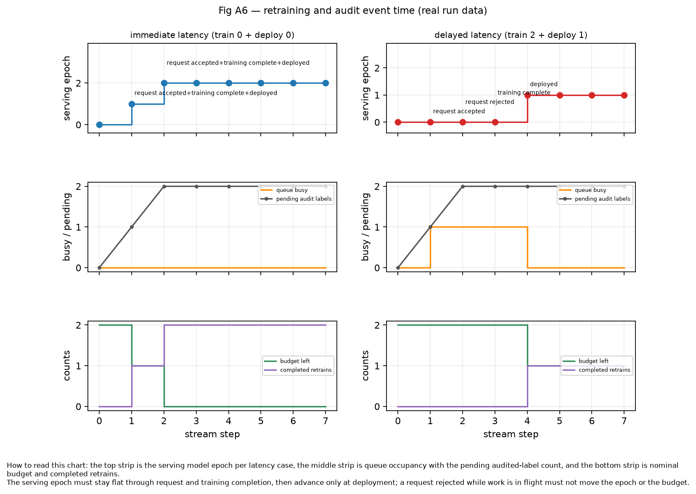<br><sub>The serving model epoch stays flat through request and training completion and advances only at deployment; a request rejected while work is in flight moves neither the epoch nor the budget.</sub> | 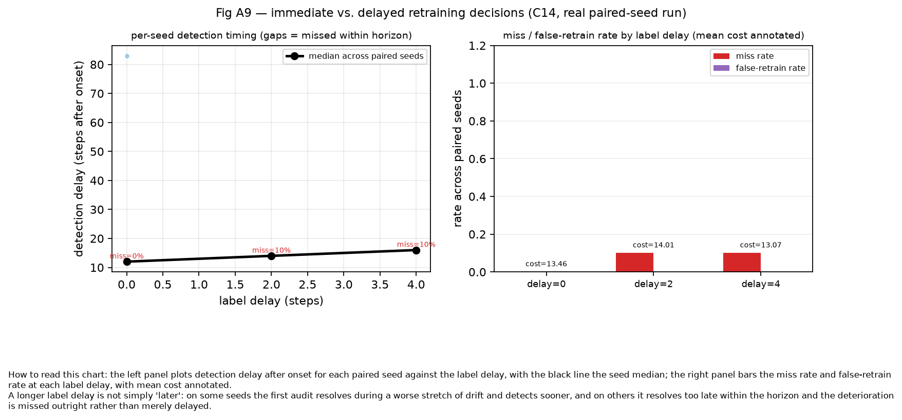<br><sub>Median detection delay tracks the label delay almost exactly (12 → 14 → 16 steps); the miss rate is the real cost, rising from 0% to 10% once the delay reaches 2 steps.</sub> |

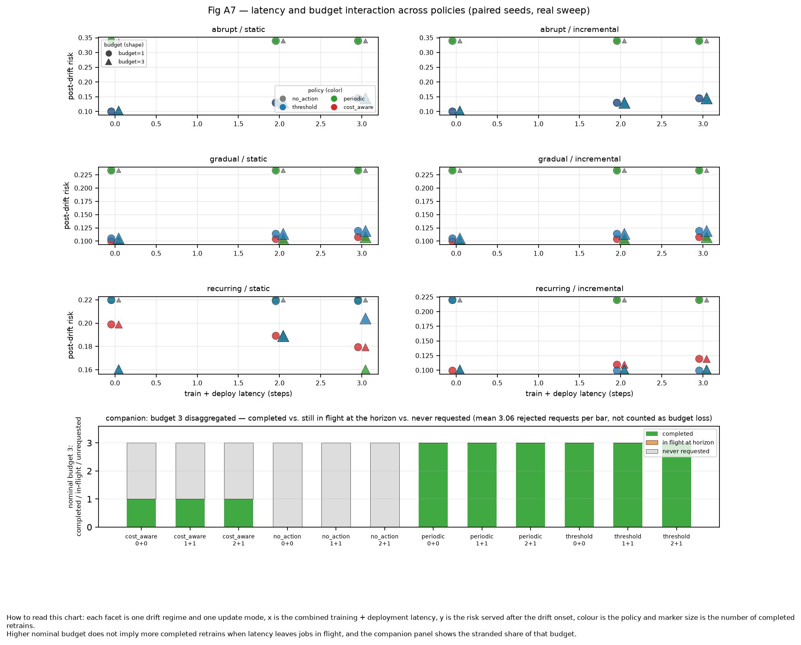

Higher nominal budget does not imply more completed retrains once latency leaves jobs in flight; the companion panel splits nominal budget into completed, still-in-flight-at-the-horizon, and never-requested capacity instead of one conflated "stranded" number.

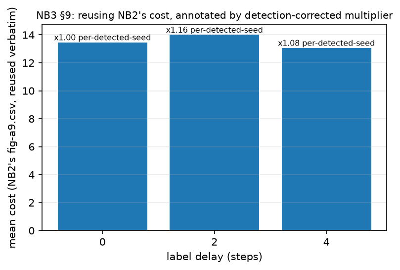

Raw mean cost under label delay is non-monotonic, because a missed detection stops charging the later stages of intervention cost. Reusing the same evidence and pricing cost per successfully detected seed instead turns that ambiguous trend into a clean result: every delayed arm costs more than the immediate one.

## Repository layout

- `leakage-proof-timeseries/` — three executed notebooks, their Python research modules, machine-readable artifacts, figure data, and provenance (see its `README.md`).
- `training-dynamics-observability/` — three executed notebooks, analytical and walkthrough modules, run ledgers, and figure evidence (see `notebooks/README.md`).
- `claims-payment-integrity-labels/` — three executed notebooks, the CCEM/SCRC/SCoRC package, figure data, and a run ledger (see `exec/README.md`).
- `label-free-model-monitoring/` — three executed notebooks, the estimator/controller/queue/policy package, and figure evidence (see `notebooks/README.md` and `exec/README.md`).
- Each collection owns its own `exec/` directory and an `exec/README.md`; no build scripts or private workflow records are published.

## Reproduce

```bash
uv sync --project leakage-proof-timeseries/exec
uv run --project leakage-proof-timeseries/exec jupyter nbconvert --execute \
  --to notebook leakage-proof-timeseries/01_research_foundations.ipynb
```

The published notebooks already contain their executed outputs. All three collections run offline on CPU with recorded seeds; notebook 03 in each collection reuses notebook 02's saved artifacts (or, for the payment-integrity collection, its digest-checked canonical stream) instead of regenerating a more favorable sample. Approximate inherited-study runtimes are 190 s, 220 s, and 25 s.

The claims payment-integrity collection uses plain CPython 3.12 rather than `uv` — see its own `exec/README.md` for the exact commands; it needs `numpy`, `scipy`, `scikit-learn`, `matplotlib` and `jupyter` importable, and has no pinned environment file yet.

The label-free monitoring collection also uses plain CPython 3.12 (`numpy`, `pandas`, `scikit-learn`, `matplotlib`, `jupyter`; no pinned environment file yet):

```bash
cd label-free-model-monitoring
python3 -m jupyter nbconvert --execute --to notebook notebooks/01_research_foundations.ipynb
```

`exec/run_study.py`'s `ensure_figures()` regenerates the figure set idempotently; notebook 03 reuses notebook 02's Fig A9 artifact verbatim rather than recomputing a more favorable sample.

## Limitations

- Purge and embargo widths for correlated-sample validation are not settled by any of the three source papers; this study evaluates the effect at fixed widths rather than proposing an optimal choice.
- No dependence-valid confidence sequence is used for heavy-tailed performance metrics — the sequential detector assumes the conditions in its source paper, which do not cover arbitrary tail behaviour.
- The change-detection audit covers a single change point with no restart or multiple-change policy.
- The training-dynamics comparison uses eight paired seeds; it is an observability demonstration, not a paper-scale power study or a stability certificate.
- The claims payment-integrity collection has no pinned environment file yet, and its strict alpha = 0.05 SCoRC certificate is `INFEASIBLE` at every studied capacity — the branch does not yet certify anything deployable at that target; provider false-positive burden and rejected-case safety are not instrumented.
- The label-free monitoring collection's immediate-vs-delayed retraining comparison covers one policy, ten paired seeds, and three delay values on a synthetic grid; it is a measured trade-off, not a general law about label delay, and its conditional retrain-count ceiling is never invoked where its adjacent-model assumption is unchecked.
- All data is synthetic; nothing here is evidence about performance on live or real-market data, or about real claims/payment-integrity outcomes.

This is a synthetic-data research portfolio and a starting point for further work — not production trading or claims-review code, and not evidence of live performance.

## Added fraud-label observability evidence

[`label-delay-fraud-models/notebooks/`](label-delay-fraud-models/notebooks/) is an executed, CPU-only fraud/identity-risk study for delayed, censored, and selectively observed labels. It connects positive-unlabeled recovery, reject-inference evaluation, and anytime monitoring on one seeded synthetic stream. Every figure has a machine-readable CSV sidecar and run provenance; claims beyond the three papers are marked **derived here**.

| Mathematical foundations | Baseline pipeline audit |
| --- | --- |
| 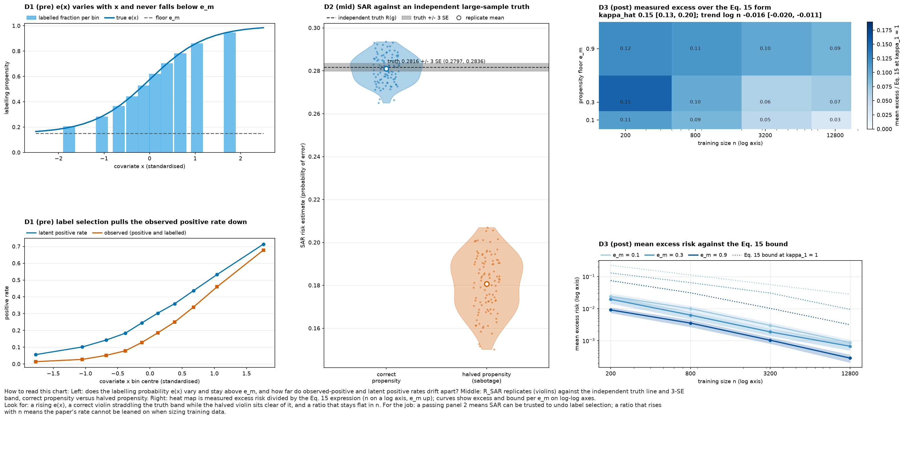<br><sub>Oracle SAR is checked against independent latent truth across propensity floors and sample sizes; the bound is displayed as a reference rather than a fitted law.</sub> | 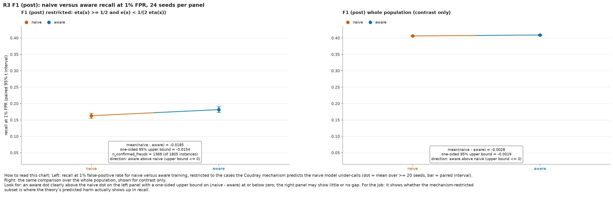<br><sub>Naive delayed-label training under-calls fraud where the source mechanism predicts the mismatch should matter; the whole-population contrast remains visible for scale.</sub> |
| 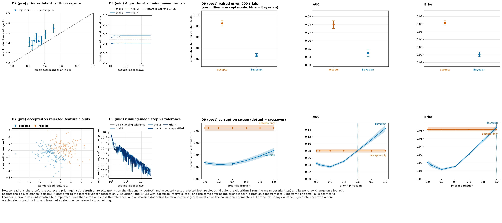<br><sub>Reject inference is tested with an accepts-trained, non-oracle prior and a corruption sweep instead of being presented as universally unbiased.</sub> | 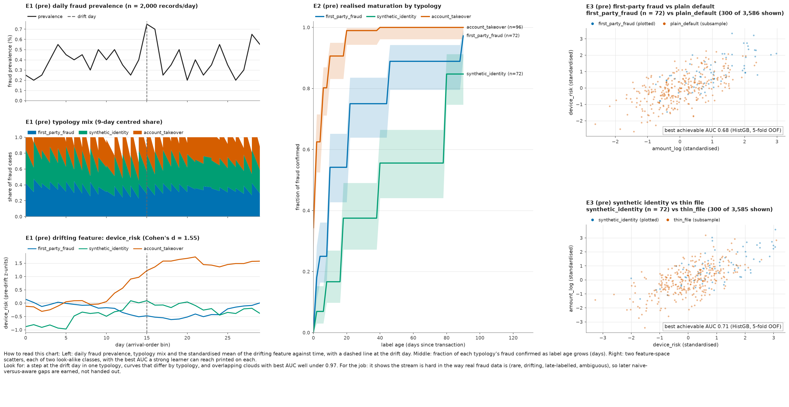<br><sub>Known latent truth, approval selection, label age, typology, and adversarial drift are separated before any model comparison.</sub> |

| Corrected operational monitoring | Label-resource observability |
| --- | --- |
| 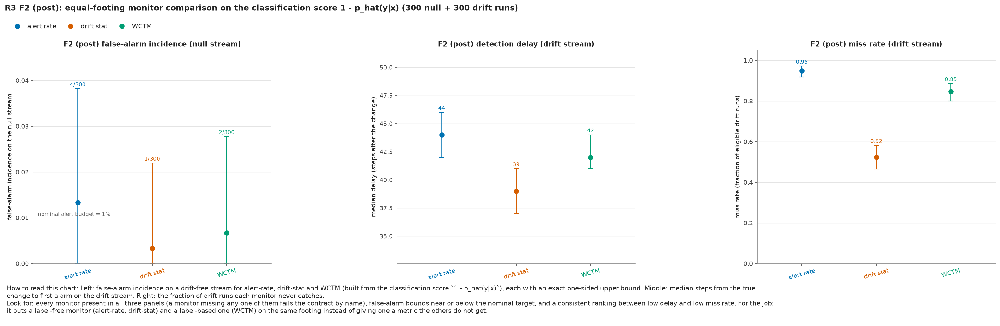<br><sub>Three monitors share one score and stream; false-alarm incidence, detection delay, and miss rate make the trade-offs inspectable without extending WATCH's guarantee beyond ready labels.</sub> | 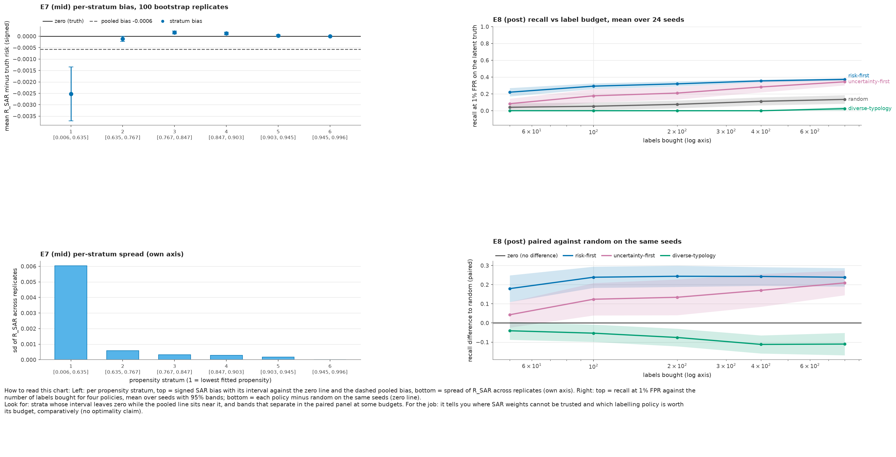<br><sub>Equal-cost label policies are empirical comparisons only: the study reports recovery, evaluation, and monitoring outcomes without asserting an optimal allocation policy.</sub> |

The three notebooks are intentionally substantial and executed in place: [NB1](label-delay-fraud-models/notebooks/NB1_mathematical_foundations.ipynb) has 76 cells / 34 output-bearing cells, [NB2](label-delay-fraud-models/notebooks/NB2_baseline_walkthrough.ipynb) has 80 / 37, and [NB3](label-delay-fraud-models/notebooks/NB3_corrected_walkthrough.ipynb) has 85 / 39. See the [notebook guide](label-delay-fraud-models/notebooks/README.md) and [execution-evidence guide](label-delay-fraud-models/exec/README.md) for scope, source mapping, and reproduction details.
